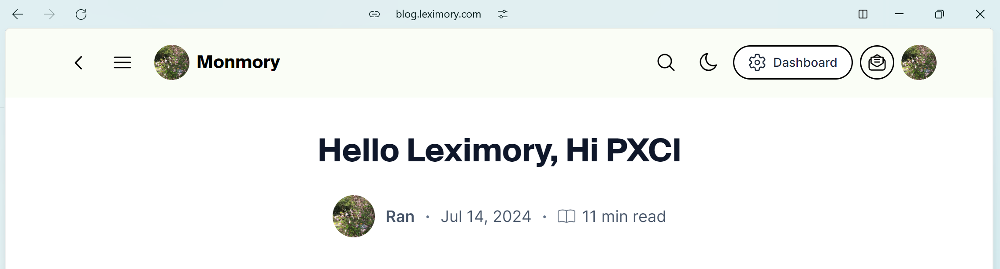

# Leximory

> Click the blog post below to learn more.
> 
> Caveat: 
> 
> This repo serves solely for demonstration for English speakers. The code may not be under active maintenence and a more capable production site (in terms of learning experience) is [leximory.com](https://leximory.com), which shall be open-sourced after going through some refactoring.

